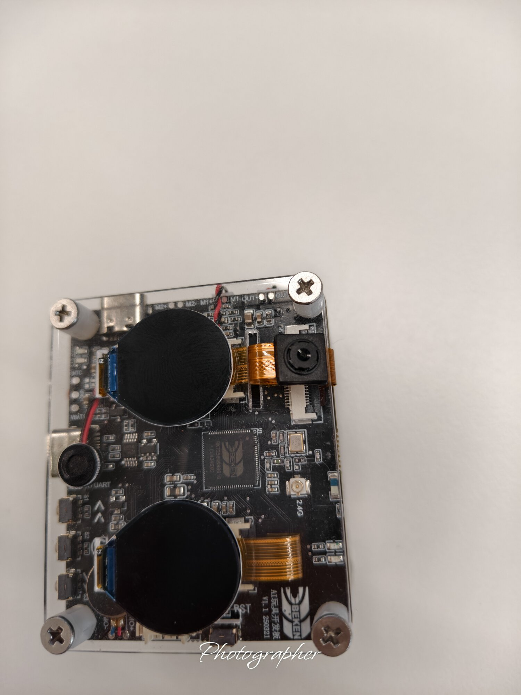
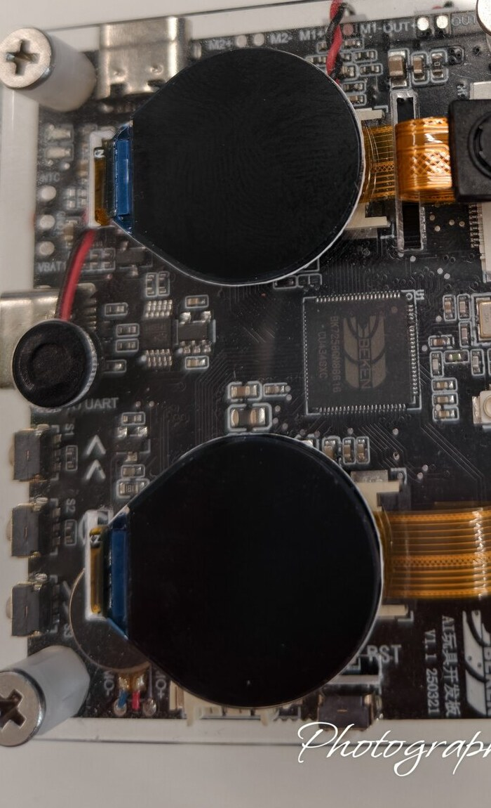

# VelaPet —— 端侧 AI 情感陪伴机器人(openvela × BK7258)

> 演示视频分镜脚本见 [`docs/演示视频_分镜脚本.md`](docs/演示视频_分镜脚本.md);
> 组委会原始使用说明备份在 [`docs/README_org_backup.md`](docs/README_org_backup.md)。



## 一、作品简介

VelaPet 是一台跑在 **BK7258 DevKit** 上、基于 **openvela(NuttX)** 的桌面 AI 情感陪伴机器人:用双圆形 LCD 当"会传情的眼睛"、摄像头当"看世界的眼睛",在**完全离线、数据不出设备**的前提下,做到"用眼神表达情绪、听得懂命令、还能测心率关心你"的陪伴体验。

本作品从 0 完成 BK7258 的 **openvela 首次板级适配**(启动引导 + UART 控制台 + 双 QSPI 屏 / DVP 摄像头 / 音频(双麦+喇叭) / I2C 加速度计 / GPIO-LED / 电量 ADC / PSRAM 等驱动),并在其上落地三个可实机演示的亮点:

- **摄像头指尖测心率(rPPG)** —— 板上无 PPG 传感器,手指轻盖摄像头,用 rPPG 把心率"算出来"(`camera hr`,实测稳定输出 bpm)。
- **离线命令词识别(自研 MFCC + DTW)** —— 麦克风 → MFCC → DTW 模板匹配 + 拒识,**纯 C、零第三方库、Apache-2.0**,断网可用(`kws enroll/run`)。
- **双圆屏拟人眼神表情** —— LVGL 双屏渲染情绪化眼神动画。



对标市面 AI 玩具机器狗"必须联网、离线即失智、隐私上云"的短板,VelaPet 把"端侧离线 AI + 健康关怀 + openvela 新板生态贡献"反过来做成卖点。

## 二、选题方向

**新硬件平台适配(BK7258,重点加分方向)** 叠加 **AI 硬件产品创新**。

- BK7258 是本届大赛官方「待适配开发板」,openvela 此前无适配。本作品完成其首次移植与多驱动 BSP,直接命中"新硬件适配"赛道核心。
- 在适配之上做"能感知、会执行"的情感陪伴产品(视觉测心率 / 离线语音 / 拟人表情),命中"AI 硬件产品创新"。
- 符合"基于 openvela"判定:同时落地**图形(LVGL 双屏)/ AI(rPPG、离线 KWS)/ 多媒体(摄像头、音频)** 三类能力。

## 三、目录结构

- `app/kws/` — **离线命令词识别**(自研 MFCC+DTW):`kws_mfcc.c`(前端)、`kws_dtw.c`(匹配)、`kws_main.c`(CLI)。
- `app/mic/` — 麦克风 PCM 采集自检(`mic test`)。
- `app/camera/` — 摄像头应用(`camera` 命令:init / 采帧 / **rPPG 测心率 hr** / 预览等);内含开发调试记录 `claude_camera_r*.txt`。
- `app/lcdtest/` — 双圆屏 / 眼神 / 体感 / 电量 / LED 等板级自测命令(`lcdtest ...`)。
- `board/contest_board/` — **BK7258 板级适配(BSP)**:`src/` 下双屏(GC9D01)、摄像头(GC2145)、音频(双麦+喇叭)、加速度计(SC7A20H)、电量 ADC、GPIO/LED 等驱动;`configs/nsh/defconfig` 板级配置;`include/` 对外头。
- `docs/` — 设计与实测文档(硬件实测清单、rPPG/KWS 方案、调试日志、演示视频分镜等)。
- `logs/` — AI Coding 会话日志(按官方手册导出归集)。
- `contest2026_098_zhanshangxingguang.xml` — 本队 manifest:`<include openvela.xml>` + `<linkfile>` 把 `board/` 与各 `app/` 软链到 openvela 编译树对应位置。

## 四、运行方式

**1) 获取工程**(用本仓自带 manifest 一键同步「openvela 全量源码 + 本专属仓」)
```bash
repo init -u https://github.com/open-vela/contest2026_098_zhanshangxingguang \
  -b dev-ai-contest-2026 -m contest2026_098_zhanshangxingguang.xml
repo sync -c -j8
```
同步后:整棵 openvela 源码在工作区外层(`nuttx/`、`apps/`、`vendor/` 等),本专属仓在 `contest2026_098_zhanshangxingguang/`;板级目录与各 app 经 manifest 的 `<linkfile>` 自动软链到编译树对应位置(含 `app/kws`、`app/mic`)。

**2) 编译**(contest 板 nsh 配置)
```bash
cd vendor/openvela
./build.sh boards/contest2026_098_board/configs/nsh --cmake -j$(nproc)
```

**3) 打包 + 烧录**(BK7258 工具链)
```bash
python3 vendor/beken/boards/bk7258/bk7258-devkit/tools/repack.py \
  --nuttx-bin cmake_out/contest2026_098_board_nsh/nuttx.bin
# 进 bk_loader 目录烧录合成镜像:
./bk_loader download -p <串口> -b 1500000 \
  -i .../bk7258-devkit/tools/bk_repack_work/all-app-nuttx.bin
```

**4) 串口连上后,在 nsh> 下实机演示**(以下命令均已上板验证):
```text
# 摄像头指尖测心率(手指轻盖摄像头、保持静止、光线稳定)
nsh> camera init
nsh> camera buf
nsh> camera hr           # 输出 HR = xx bpm(加 v 看调试细节)

# 离线命令词识别(看到 [mic] init done 后清晰说出命令词)
nsh> kws enroll qixinlv  # 登记"查心率"(可多录几遍)
nsh> kws enroll yundong  # 登记"开始运动"
nsh> kws run             # 说命令词 → MATCH/REJECTED + 距离
nsh> kws list            # 查看已登记模板

# 双圆屏拟人眼神
nsh> lcdtest             # 双圆屏点亮 + 清屏自检
nsh> lcdtest oeye        # 拟人眼神
nsh> lcdtest blink       # 眨眼动画
nsh> lcdtest anim        # 眼神动画

# 体感交互(手势:拿起 / 摇动;按 Enter 结束)
nsh> lcdtest accel g     # PICKUP=拿起、SHAKE=摇动

# 电量 + 低电提醒
nsh> lcdtest bat         # 读电量;低电时红灯闪烁

# LED 情绪灯
nsh> lcdtest led <pin> <0|1>   # 点亮/熄灭指定 LED

# 麦克风自检
nsh> mic test            # 16kHz PCM 采集,打印 RMS/peak

# (可选)整合情感演示:拿起唤醒 / 摇动开心 / 眨眼 / 低电
nsh> camera velapet
```

> 提示:摄像头测心率用**指尖**;命令词识别为**说话人相关**,请用本人登记后再识别;体感手势以**拿起 / 摇动**为准。
测输出
### 实示例(真实串口日志,非模拟数据)

> 以下为开发板真实串口输出;为便于阅读,已把麦克风上电初始化的刷屏日志用 `…略…` 省略,数值未做任何改动。

**摄像头指尖测心率 `camera hr`**(手指盖住摄像头、静止约 20 秒;三窗一致 → 判定 good):
```text
nsh> camera hr
[camera] DVP module clock enabled ...
[hr] cover the camera fully with a fingertip, hold still; measuring ...
[hr] AEC locked; sampling 450 frames ...
[hr] 450 samples, fps=27.69
[hr]   win0: 62.0 bpm  corr=63%  PI=1.0%
[hr]   win1: 60.0 bpm  corr=74%  PI=1.0%
[hr]   win2: 60.1 bpm  corr=75%  PI=1.0%
[hr] HR = 60.1 bpm  (windows=3/3  corr=75%  PI=1.0%  good)
```

**离线命令词 `kws run` —— 命中**(登记"查心率"/"开始运动"各 2 遍,`thresh=11`;说"开始运动"):
```text
nsh> kws run
[kws] speak the command now ...
 …略(麦克风 init 日志)…
[kws] captured 16000 samples, 48 MFCC frames
[kws] distances (lower = closer):
    [0] qixinlv        12.52
    [1] qixinlv        12.81
    [2] yundong         3.84
    [3] yundong         6.01
[kws] MATCH: "yundong"  (dist=3.84, other=12.52, thresh=11.00)
```

**离线命令词 `kws run` —— 拒识**(说一句无关的话,best 未过阈值/异词裕度 → 安全拒识,不误报):
```text
nsh> kws run
 …略…
[kws] distances (lower = closer):
    [0] qixinlv        13.77
    [1] qixinlv        13.73
    [2] yundong        11.78
    [3] yundong        11.49
[kws] REJECTED (best="yundong" dist=11.49, other=13.73, thresh=11.00)
```

> `dist` = 与最近模板的 DTW 距离(越小越像),`other` = 最近的**另一个**命令词距离;判定需 `dist ≤ thresh` 且明显小于 `other`,兼顾命中与拒识。

## 五、AI Coding 使用说明

本作品全程借助 AI 辅助开发(Claude / MiMo 系模型 + openvela 官方 AI Skills),覆盖:

- **需求拆解 / 方案设计**:用 AI 梳理 BK7258 外设 bring-up 顺序、rPPG 与 KWS 的算法选型(如离线 KWS 明确选"自研 MFCC+DTW"以规避闭源库、保证 Apache-2.0 合规)。
- **编码**:AI 生成板级驱动与算法代码(如 KWS 的自写 FFT/Mel/DCT/DTW、摄像头 rPPG 流水线),并按 NuttX 规范落地。
- **调试**:AI 参与定位真实问题——例如 KWS 上板时"所有 builtin 报 command not found",经分析定位为**静态 BSS 占满内部 RAM 致堆不足、task_spawn 失败**,通过压缩特征缓冲(定长归一 + 两遍法)修复;以及 16kHz 采集提前中止、端点检测长度不一致导致误判等,均有据可查。
- **文档**:AI 协助整理硬件实测清单、调试日志(`docs/`、`app/camera/claude_camera_r*.txt`)。

AI 对效率与质量的实际帮助:在无 openvela 适配先例的新芯片上,显著加快了从寄存器级驱动到端侧算法的落地;并通过"上板实测 → 贴回日志 → AI 复盘"的闭环持续纠偏,坚持**不用假数据、诚实标注已知限制**。完整对话日志见 `logs/` 目录。

## 六、已知限制与后续(诚实说明)

- **测心率**:主打**指尖 rPPG**(手指盖镜头),稳定可用;**隔空 rPPG** 因人脸区域信噪比低、准确率有限,列为探索方向,暂不作为演示项。
- **离线命令词**:**说话人相关**的模板匹配(需本人登记)、词表规模小;含糊发音会**安全拒识(不误报)**。后续可升级到 TFLM + DS-CNN(int8)做说话人无关识别;自由对话可选联网走云端 LLM。
- **体感手势**:**拿起 / 摇动**稳定;**轻拍**因板载加速度计 click 引擎在本板上不稳,已改用拿起/摇动,不主推轻拍。
- **双眼表情**:`oeye / blink / anim` 正常;`emo` 存在**左右眼镜像**问题待修,不作为演示项。
- **视觉识别(人脸/表情/手势、眼神跟随)**:属探索/进阶,未达稳定演示标准,不计入核心功能。
- **NFC(MFRC522)**:**未实现**,不在本次范围。

> 说明:以上为如实边界。核心可演示能力(指尖测心率、离线命令词、双屏眼神、体感拿起/摇动、电量+低电红灯、LED)均已上板实测。

## 七、许可证

遵循 **Apache License 2.0**。板级适配与各 app 代码均为原创;离线命令词识别为纯自研实现,无第三方运行时依赖。
